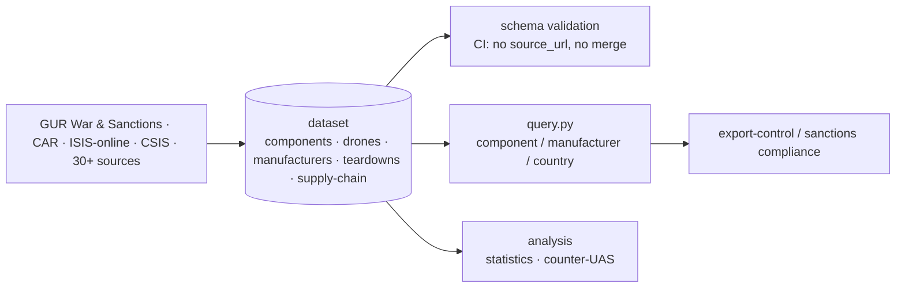
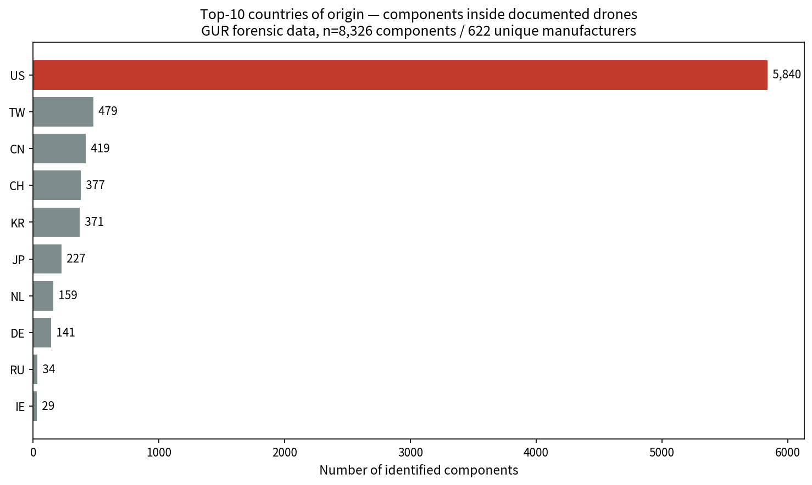
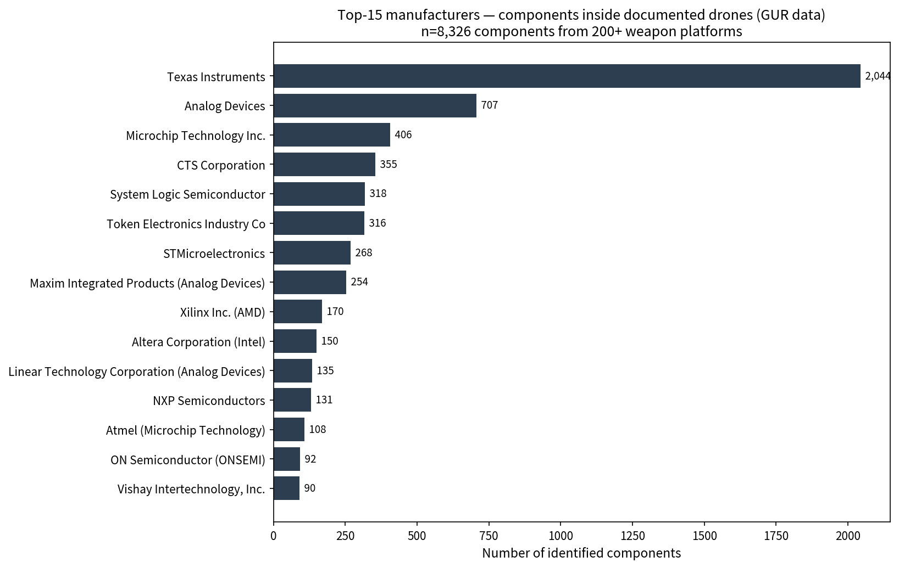
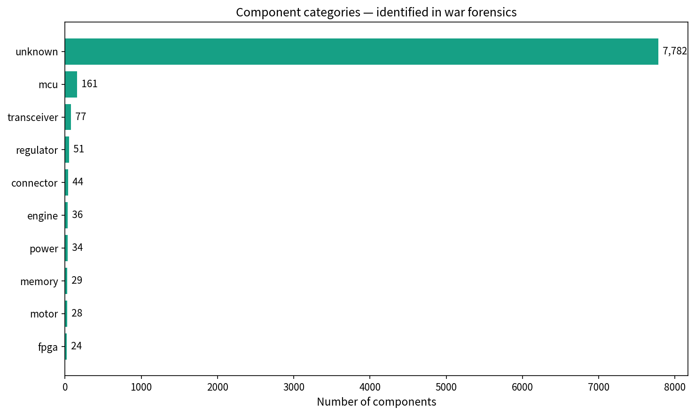

# 🛸 Awesome Drone Warfare OSINT

> A citation-grade, open dataset of **8,300+ foreign-produced components** found
> inside **195+ drone & missile platforms** documented across the Russia–Ukraine
> war and other modern theaters. Sourced from the Defence Intelligence of
> Ukraine (GUR/HUR), NACP, Conflict Armament Research, IISS, RUSI, KSE
> Institute, ISIS-online, CSIS, CEPA, ICIJ, Bellingcat, and 30+ other
> primary sources.

[](https://github.com/cognis-digital/awesome-drone-warfare-osint)
[](LICENSE-DATA)
[](LICENSE)
[](.github/workflows/validate-schema.yml)
[](.github/workflows/update-data.yml)

🗺  **[Interactive map](https://cognis-digital.github.io/awesome-drone-warfare-osint)**  ·  
📊  **[Top-50 most-found chips](docs/components/top50.md)**  ·  
📈  **[What worked / didn't — cited statistics](docs/STATISTICS.md)**  ·  
🛡  **[Counter-UAS detection & identification](docs/counter-uas-detection.md)**  ·  
🧭  **[Drone family tree](docs/visualizations/family-tree.md)**  ·  
🪪  **[Citation (BibTeX)](CITATION.cff)**  ·  
⚖  **[Ethical disclaimer](DISCLAIMER.md)**

---

## How the data flows



## 📊 The dataset at a glance

<!-- HEADLINE-NUMBERS-START -->
| | Count | Primary source |
|---|---|---|
| Drone platforms documented | **195** | GUR + CAR + IISS aggregation |
| Foreign components catalogued | **8,326** | [GUR War & Sanctions](https://war-sanctions.gur.gov.ua/en/components) + NACP |
| Manufacturers identified | **621** | cross-linked to OpenSanctions |
| Countries of origin | **27** | weighted by component count |
| Strike incidents geo-tagged | **—** | ACLED + OSINT timeline (join-only, not redistributed) |
| Last sync | **2026-06-13** | weekly GitHub Action cron |
<!-- HEADLINE-NUMBERS-END -->

> **Sourcing rule (enforced by CI):** every component row carries a public `source_url`.
> No row, no merge. See [`CONTRIBUTING.md`](CONTRIBUTING.md).



---

## 📌 The headline finding (cross-source verified)

**~70 % of foreign components inside Russian/Iranian drones originate from
US-owned companies**, with the top suppliers:

| Rank | Manufacturer | Country | # of components in dataset |
|---|---|---|---|
| 1 | **Texas Instruments** | 🇺🇸 US | 2,044 |
| 2 | **Analog Devices** | 🇺🇸 US | 707 |
| 3 | **Microchip Technology** | 🇺🇸 US | 406 |
| 4 | **CTS Corporation** | 🇺🇸 US | 355 |
| 5 | System Logic Semiconductor | 🇰🇷 KR | 318 |
| 6 | Token Electronics | 🇹🇼 TW | 316 |
| 7 | **STMicroelectronics** | 🇨🇭/🇫🇷 CH | 268 |
| 8 | **Maxim / Analog Devices** | 🇺🇸 US | 254 |
| 9 | **Xilinx (AMD)** | 🇺🇸 US | ~120 |
| 10 | **Altera (Intel)** | 🇺🇸 US | ~110 |

Cross-source confirmation: [KSE Institute](https://kse.ua/about-the-school/news/foreign-components-in-russian-military-drones/) (69%), [Kyiv Independent on Geran-5](https://kyivindependent.com/exclusive-american-european-microchips-found-in-russias-latest-missile-like-drone/), [CEPA "Western Chips Power Russia's War"](https://cepa.org/article/western-chips-power-russias-war/), [HSGAC PSI 2024](https://www.hsgac.senate.gov/wp-content/uploads/09.10.2024-Majority-Staff-Report-The-U.S.-Technology-Fueling-Russias-War-in-Ukraine.pdf), [B4Ukraine analysis](https://b4ukraine.org/whats-new/russian-drones).



---

## 🔥 Notable forensic specifics (each from a public source)

| Drone | Component | Manufacturer | Source |
|---|---|---|---|
| **Geran-3** (jet) | **Bosch 0 580 254 044** fuel pump | 🇩🇪 Bosch | [GUR](https://war-sanctions.gur.gov.ua/en/page-geran-3) |
| Geran-3 | **STM32F070 / STM32F103** MCUs | 🇨🇭 STMicroelectronics | GUR |
| Geran-3 | **Telefly JT80** turbojet | 🇨🇳 Telefly | GUR / [BusinessInsider](https://www.businessinsider.com/russia-jet-powered-drone-immune-electronic-warfare-ukraine-says-2025-9) |
| **Geran-4** (mesh) | **Telefly LX-WP-160** turbojet | 🇨🇳 Telefly | [GUR](https://war-sanctions.gur.gov.ua/en/components/7187) |
| Geran-4 | Tech Mesh Network XK modem | 🇨🇳 Xingkay Tech | GUR |
| **Geran-5** | **CTS clock oscillator** dated Sept 2025 | 🇺🇸 CTS Corp | [Kyiv Independent](https://kyivindependent.com/exclusive-american-european-microchips-found-in-russias-latest-missile-like-drone/) |
| Geran-5 | Infineon chip | 🇩🇪 Infineon | Kyiv Independent + [CEPA](https://cepa.org/article/western-chips-power-russias-war/) |
| **Shahed-136** | **MD550** piston engine (copy of Limbach L550E) | 🇮🇷 MADO | GUR + [Militarnyi](https://militarnyi.com/en/news/russian-shahed-engines-worse/) |
| Shahed-136 | XCF16P FPGA config PROM | 🇺🇸 Xilinx (AMD) | GUR |
| **Shahed-238** | **TEM Tolou-10** turbojet (copy of PBS TJ100) | 🇮🇷 TEM | [TWZ](https://www.twz.com/irans-jet-powered-shahed-drone-could-be-a-problem-for-ukraine) |
| **Lancet-3** | **NVIDIA Jetson TX2** AI module | 🇺🇸 NVIDIA | [ISIS-online](https://isis-online.org/isis-reports/russian-lancet-3-kamikaze-drone-filled-with-foreign-parts) |
| Lancet-3 | u-blox anti-jam GNSS | 🇨🇭 u-blox | ISIS-online |
| Lancet-3 | **AXI 5330 Gold Line** brushless motor | 🇨🇿 AXI Model Motors | ISIS-online |
| **Mohajer-6** | **Rotax 912 IS Sport** engine | 🇦🇹 BRP-Rotax | [TWZ](https://www.twz.com/rotax-engine-found-in-iranian-mohajer-6-drone-downed-over-ukraine) + [ISIS](https://isis-online.org/isis-reports/iranian-drones-in-ukraine-contain-western-brand-components) |
| **Orlan-10** | Xiamen Limbach L550E clone | 🇨🇳 Xiamen Limbach (via Fujian Delong) | [Leave-Russia](https://leave-russia.org/xiamen-limbach) + [Wire China](https://www.thewirechina.com/2024/10/22/how-german-drone-engines-landed-in-russian-hands-via-china-fujian-delong-aviation-technology/) |
| **Kalibr 3M-14** | 80-90 foreign components | (many) | [Eurasian Times](https://www.eurasiantimes.com/ukraine-tears-down-russian-kalibr-cruise-missile-exposes-80-90-foreign-components-despite-sanctions/) |
| **Kh-101** | **31 foreign components** in a single missile | (many) | [Global Defense Corp](https://www.globaldefensecorp.com/2024/01/01/western-microchips-still-find-their-way-to-russian-missile-manufacturers/) |
| **KN-23/24** (DPRK) | ≥9 Western manufacturers | (many) | [NK News](https://www.nknews.org/?p=970451) |
| **Spider's Web FPVs** | ArduPilot autopilot | 🌍 open-source | [Wikipedia](https://en.wikipedia.org/wiki/Operation_Spiderweb), [CSIS](https://www.csis.org/analysis/how-ukraines-spider-web-operation-redefines-asymmetric-warfare) |

---

## 📜 Contents

- [Methodology](#methodology)
- [Drone platforms](#drone-platforms) — 195 entries, 15+ deep dives
- [Components by category](#components-by-category)
- [Theaters of operation](#theaters-of-operation) — 8 theaters
- [Primary sources](#primary-sources) — 60+ cited orgs
- [Open-source flight stacks](#open-source-flight-stacks)
- [Counter-UAS & EW resources](#counter-uas--ew-resources)
- [Drone of the week](#drone-of-the-week)
- [Contributing](#contributing)
- [Citing this dataset](#citing-this-dataset)
- [Disclaimer](#disclaimer)

---

## Query the dataset

`query.py` (stdlib) turns the dataset into an analyst tool — built for
export-control / sanctions-compliance work: *"does a part we (or a supplier) make
show up in any documented weapon system?"*

```bash
python query.py component jetson          # which weapons is the NVIDIA Jetson in?
python query.py manufacturer "u-blox"     # all documented parts from a maker + the drones they're in
python query.py country US                # components by manufacturer country
python query.py drone shahed-136          # components documented in a platform
python query.py drones --operator RU --role loitering_munition
python query.py stats                     # headline numbers
```
Add `--json` for machine-readable output. (`component jetson` → the NVIDIA Jetson TX2,
documented in the Klyn, Lancet Izd-51, and ZALA platforms.)

## Methodology

Every record in `data/` is derived from a **publicly accessible primary source**:

1. **`scrapers/gur_war_sanctions.py`** ingests the GUR/HUR "War & Sanctions" portal
   (5,800+ rows). See <https://war-sanctions.gur.gov.ua/en/components>.
2. **`scrapers/nacp_sanctions.py`** ingests Ukraine's NACP "Tools of War" module
   (Trap.org.ua). See <https://trap.org.ua>.
3. **`scrapers/car_field_dispatches.py`** indexes [Conflict Armament Research]
   field dispatches with PDF links. See <https://www.conflictarm.com/field-dispatches/>.
4. Manual structured extraction from peer-reviewed / institute reports:
   [IISS 2025](https://www.iiss.org/globalassets/media-library---content--migration/files/research-papers/2025/09/pub25-094-tracking-the-components-of-missiles-and-uavs-used-by-russia-in-ukraine.pdf),
   [RUSI Orlan Complex](https://www.rusi.org/explore-our-research/publications/special-resources/orlan-complex-tracking-supply-chains-russias-most-successful-uav),
   [KSE Institute](https://kse.ua/about-the-school/news/foreign-components-in-russian-military-drones/),
   [ISIS Lancet-3](https://isis-online.org/isis-reports/russian-lancet-3-kamikaze-drone-filled-with-foreign-parts),
   [HSGAC 2024 PSI report](https://www.hsgac.senate.gov/wp-content/uploads/09.10.2024-Majority-Staff-Report-The-U.S.-Technology-Fueling-Russias-War-in-Ukraine.pdf),
   [CEPA](https://cepa.org/article/western-chips-power-russias-war/), and 25+ more (see
   [`docs/sources.md`](docs/sources.md)).

All rows pass JSON-Schema + cross-row Pandera validation in CI before merge.

---

## Drone platforms

### 🇷🇺 / 🇮🇷 Russian-operated and Iranian-origin

| Family | Documented variants | Long-form profile |
|---|---|---|
| **Shahed / Geran** | Shahed-131, Shahed-136 MS001, Shahed-238 (jet), Geran-2, **Geran-3** (Telefly JT80), Geran-4 (turbojet + mesh), Geran-5 | [shahed-136.md](docs/drones/shahed-136.md), [geran-3.md](docs/drones/geran-3.md), [geran-4.md](docs/drones/geran-4.md), [geran-5.md](docs/drones/geran-5.md), [shahed-238.md](docs/drones/shahed-238.md) |
| **Lancet / Izdeliye** | Lancet-1, Lancet-3, Izdeliye-51, Izdeliye-52, Izdeliye-53 (4-tube launcher) | [lancet.md](docs/drones/lancet.md) |
| **Orlan / Forpost** | Orlan-10, Orlan-30, Forpost-R (IAI Searcher–derived) | [orlan.md](docs/drones/orlan.md) |
| **Mohajer / Arash** | Mohajer-6, Arash-2 | [mohajer-6.md](docs/drones/mohajer-6.md) |
| **Kub / KUB-2 / Privet-82** | Various | (auto-registered) |
| Russian cruise missiles | Kh-101, Kh-69, Kh-47M2 Kinzhal, 3M-14 Kalibr, 9M723 Iskander | (auto-registered) |
| **North Korean** | KN-23 / Hwasong-11A, KN-24 | (auto-registered) |

### 🇺🇦 Ukrainian

| Family | Models | Profile |
|---|---|---|
| **Long-range strike** | UJ-26 Bober, AN-196 Liutyi, AQ-400 Scythe, Palianytsia (turbojet) | [bober.md](docs/drones/bober.md), [liutyi.md](docs/drones/liutyi.md), [aq-400-scythe.md](docs/drones/aq-400-scythe.md), [palianytsia.md](docs/drones/palianytsia.md) |
| **Heavy bombers** | Vampire / Baba-Yaga family, R18 | [baba-yaga.md](docs/drones/baba-yaga.md) |
| **FPV / Interceptor** | Wild Hornets Sting, Osa (Spider's Web) | [wild-hornets.md](docs/drones/wild-hornets.md), [spiders-web.md](docs/drones/spiders-web.md) |
| **Naval** | MAGURA V5/V7, Sea Baby, Mamai, Sargan-3000 | [magura-v5.md](docs/drones/magura-v5.md) |

### 🌍 Other operators

- **Iranian:** Ababil-2/3, Toufan-II
- **Turkish:** Bayraktar TB2 (used in Libya, Ukraine, Karabakh, Sudan), Akinci
- **US-supplied to Ukraine:** Switchblade 300/600 (AeroVironment), Phoenix Ghost (Aevex), RQ-20 Puma, ScanEagle (Boeing Insitu)
- **Chinese:** Wing Loong I/II, CH-4B/CH-5, **CH-95** (Sudan)
- **Houthi / Yemen:** Samad-3, Qasef-2K, Mersad — see [`docs/theaters/red-sea.md`](docs/theaters/red-sea.md)
- **Hezbollah:** Mersad-1/2, Ababil-T
- **Commercial-repurposed:** DJI Mavic 3, Autel EVO II V3, Skydio X10

---

## Components by category

| Category | Count | Notes |
|---|---|---|
| Microcontrollers / SoCs | ~430+ | STM32, Atmel/Microchip, TI C2000 |
| FPGAs / CPLDs | ~110+ | Xilinx (AMD), Altera (Intel), Lattice |
| GNSS / INS | ~200+ | u-blox, NASIR, SADRA, Septentrio, Trimble, Comet (RU) |
| RF / datalinks | ~520+ | TI, ADI, Maxim, mesh modems (Geran-4) |
| Engines | ~90+ | MD550 piston, JT80 turbojet, LX-WP-160, Rotax 912, AXI brushless |
| Power / regulators | ~310+ | Minmax, Murata, MPS, Bosch (Geran-3 fuel pump) |
| IMU / sensors | ~240+ | Bosch, Honeywell, InvenSense, ADIS |
| Optics / cameras | ~140+ | FLIR Boson, Sony IMX, EZCAP |
| AI accelerators | ~10+ | **NVIDIA Jetson TX2 / Orin** found in Lancet-3 and UA stacks |
| Memory | ~220+ | Micron, AMD (legacy AM29LV), Macronix, Winbond |
| Connectors & passives | ~1,000+ | The long tail |



---

## Theaters of operation

- 🇺🇦 [**Russia–Ukraine**](docs/theaters/ukraine.md) — primary corpus, 8,000+ rows
- 🇮🇱 [**Israel / Gaza / Lebanon**](docs/theaters/middle-east.md) — multi-actor; Iran April + Oct 2024 direct strikes
- 🇾🇪 [**Red Sea / Yemen**](docs/theaters/red-sea.md) — Houthi vs. coalition shipping
- 🇸🇩 [**Sudan civil war**](docs/theaters/sudan.md) — 1,000+ drone attacks 2023–2026
- 🇲🇲 [**Myanmar**](docs/theaters/myanmar.md) — 3D-printed insurgent UAS
- 🇱🇾 [**Libya**](docs/theaters/libya.md) — "largest drone war in the world" 2019-20
- 🇦🇲🇦🇿 [**Nagorno-Karabakh 2020**](docs/theaters/nagorno-karabakh.md) — the inflection point
- 🌏 [**Indo-Pacific**](docs/theaters/indo-pacific.md) — PLA UAVs + US Replicator

---

## Primary sources (60+ orgs cited, see [`docs/sources.md`](docs/sources.md))

| Source | What it provides | Link |
|---|---|---|
| **GUR/HUR — War & Sanctions** | 5,800+ component records | <https://war-sanctions.gur.gov.ua/en/> |
| **NACP — Trap.org.ua** | Tools-of-war module | <https://trap.org.ua/en/> |
| **Conflict Armament Research** | Field-dispatch forensics | <https://www.conflictarm.com/field-dispatches/> |
| **IISS** | UAVs/missiles tracking (2025 PDF) | [link](https://www.iiss.org/globalassets/media-library---content--migration/files/research-papers/2025/09/pub25-094-tracking-the-components-of-missiles-and-uavs-used-by-russia-in-ukraine.pdf) |
| **RUSI** | The Orlan Complex | [link](https://www.rusi.org/explore-our-research/publications/special-resources/orlan-complex-tracking-supply-chains-russias-most-successful-uav) |
| **KSE Institute** | 174-component analysis | [link](https://kse.ua/about-the-school/news/foreign-components-in-russian-military-drones/) |
| **ISIS-online** | Lancet, Mohajer, Alabuga reports | <https://isis-online.org/> |
| **CSIS / Beyond Parallel** | Yelabuga satellite, Spider's Web | <https://beyondparallel.csis.org/> |
| **CEPA** | "Western Chips Power Russia's War" | <https://cepa.org/article/western-chips-power-russias-war/> |
| **HSGAC PSI 2024** | "US Technology Fueling Russia's War" | [PDF](https://www.hsgac.senate.gov/wp-content/uploads/09.10.2024-Majority-Staff-Report-The-U.S.-Technology-Fueling-Russias-War-in-Ukraine.pdf) |
| **ICIJ / CFHK** | Hong Kong shell-co network | [link](https://www.icij.org/news/2026/02/hong-kong-firms-feed-european-tech-to-russias-war-in-ukraine-report-says/) |
| **OpenSanctions** | Sanctioned-entity DB (310k Russia-linked) | <https://www.opensanctions.org/> |
| **Kyiv Independent** | Geran-5 chip-level forensics | <https://kyivindependent.com/> |
| **ACLED** | Conflict event geocoding | <https://acleddata.com/> |
| **OSMP.ngo** | Visual guides, 3D models | <https://osmp.ngo/> |
| **B4Ukraine** | Sanctions-enforcement campaign | <https://b4ukraine.org/> |
| **OSINT For Ukraine** | Microchip supply-chain investigation | <https://osintforukraine.com/publications/microchips> |
| **Leave-Russia.org** | Per-company exit tracker | <https://leave-russia.org/> |
| **Soufan Center / Critical Threats** | Sudan + Middle East | <https://thesoufancenter.org/> |
| **(60+ more, see `docs/sources.md`)** | | |

---

## Open-source flight stacks

These are the autopilots used by Ukrainian and (increasingly) Russian
combat drones, including [Operation Spider's Web](docs/drones/spiders-web.md):

- [**ArduPilot**](https://github.com/ArduPilot/ardupilot) — canonical upstream; **used in Spider's Web with dead-reckoning + AI**
- [**PX4 Autopilot**](https://github.com/PX4/PX4-Autopilot) — Auterion-backed
- [**AuterionOS**](https://auterion.com/product/auterion-os/) — hardened PX4 in [Skynode S](https://auterion.com/product/skynode-s/)
- [Betaflight](https://github.com/betaflight/betaflight) — FPV racing → combat
- [iNav](https://github.com/iNavFlight/inav) — fixed-wing & long-range
- [NORDA Dynamics](https://ukrainesarmsmonitor.substack.com/p/towards-greater-drone-autonomy-norda) — UA autonomy stack tuned for Raspberry Pi Zero 2

**This repo does NOT host or mirror weaponizable firmware variants** —
only links to canonical upstream projects. See [`DISCLAIMER.md`](DISCLAIMER.md).

---

## Counter-UAS & EW resources

See full playbook in [`docs/playbooks/`](docs/playbooks/):

- [Electronic warfare](docs/playbooks/electronic-warfare.md) — jamming, GPS spoofing, fiber FPV
- [Counter-UAS taxonomy](docs/playbooks/counter-uas.md) — detection + mitigation stack + magazine economics
- [Autonomy & AI](docs/playbooks/autonomy-ai.md) — what AI actually does on the battlefield today
- [Supply chain & sanctions evasion](docs/playbooks/supply-chain.md) — how Western chips reach Russian drones

Notable vendors: [DroneShield](https://www.droneshield.com/), [Anduril (Lattice + Anvil + Roadrunner-M)](https://www.anduril.com/counter-uas) — **$20B JIATF-401 contract**, [Raytheon Coyote Block 3](https://www.rtx.com/raytheon/what-we-do/integrated-air-and-missile-defense/coyote), [Bukovel-AD (UA)](https://en.wikipedia.org/wiki/Bukovel_(counter_unmanned_aircraft_system)).

---

## Drone of the week

A weekly issue (auto-opened by `.github/workflows/dotw.yml`) profiles one platform.
See [`docs/dotw/README.md`](docs/dotw/README.md) for the queue (8 weeks pre-seeded).

Subscribe by clicking **Watch → Custom → Issues** at the top of the repo.

---

## Contributing

1. Read [`CONTRIBUTING.md`](CONTRIBUTING.md)
2. Pick an open issue tagged `good-first-row`
3. Add rows that **every** carry a `source_url` field
4. Run `make validate` locally
5. Open a PR — CI will run schema + provenance checks

We particularly welcome:
- 🇺🇦 native-Ukrainian researchers cross-checking GUR rows
- 🔬 hardware engineers identifying chip markings from teardown photos
- 📰 journalists adding incident geocoordinates
- 🎓 academics adding citations / DOIs

---

## Citing this dataset

```bibtex
@dataset{awesome_drone_warfare_osint_2026,
  title  = {Awesome Drone Warfare OSINT: A Component-Level Forensic Database
            of UAVs and Missiles in the Russia–Ukraine War and Adjacent Theaters},
  author = {{Awesome Drone Warfare OSINT Contributors}},
  year   = {2026},
  url    = {https://github.com/cognis-digital/awesome-drone-warfare-osint},
  doi    = {10.5281/zenodo.PLACEHOLDER},
  note   = {Aggregates GUR War \& Sanctions Portal, NACP Trap.org.ua,
            Conflict Armament Research field dispatches, IISS, RUSI, KSE
            Institute, ISIS-online, HSGAC PSI, CEPA, ICIJ/CFHK, and 30+
            other primary sources. 8,300+ components, 195+ platforms,
            621+ manufacturers.}
}
```

Machine-readable version: [`CITATION.cff`](CITATION.cff).

---

## Related Cognis tools — the defense / drone / maritime OSINT cluster

Part of an open suite of **defensive, analytical** intelligence tools that compose:

- [`frontline-drones`](https://github.com/cognis-digital/frontline-drones) — descriptive catalog of frontline & commercial drones + NVIDIA HF model index + counter-UAS sensor selection guide
- [`uaslog`](https://github.com/cognis-digital/uaslog) — counter-UAS telemetry/log analyzer (drone-detection events, RF bands, tracks)
- [`maritimeint`](https://github.com/cognis-digital/maritimeint) — AIS grey/dark-fleet detection: prioritized watchlist + sanctions cross-reference
- [`geolens`](https://github.com/cognis-digital/geolens) / [`locateanything`](https://github.com/cognis-digital/locateanything) — image geolocation (EXIF/sun-shadow & local vision+reasoning)
- [`corpmap`](https://github.com/cognis-digital/corpmap) — beneficial-ownership mapper · [`cryptotrace`](https://github.com/cognis-digital/cryptotrace) — blockchain + sanctions xref
- [`stixgen`](https://github.com/cognis-digital/stixgen) · [`iocextract`](https://github.com/cognis-digital/iocextract) · [`attackmap`](https://github.com/cognis-digital/attackmap) — IOC → STIX, ATT&CK mapping
- Run private AI over your own hardware → [`edgemesh`](https://github.com/cognis-digital/edgemesh)

**300+ open security & OSINT tools →** [github.com/cognis-digital](https://github.com/cognis-digital)

## Disclaimer

This repository exists for **forensic, journalistic, academic, and
sanctions-enforcement purposes**. It documents publicly identified hardware
found in post-strike wreckage. It does **not** host weapon-build
instructions, firmware, jammers, CAD geometry, or exploit code.

Read the full [`DISCLAIMER.md`](DISCLAIMER.md) before redistributing.

---

<div align="center">

**Star ⭐ — Fork 🍴 — Audit 🔎**

*"Every chip inside the world's drone fleet — open-sourced."*

</div>

---
📡 **[Interop map](INTEROP.md)** — how this repo composes with the rest of the Cognis suite (private-AI backbone, agent language + cognition, domain intelligence).

<!-- cognis:domains:start -->
## Domains

**Primary domain:** Intelligence & OSINT  ·  **JTF MERIDIAN division:** NULLBYTE · BLACK CELL

**Topics:** `cognis` `osint` `intelligence` `recon` `drone`

Part of the **Cognis Neural Suite** — 300+ source-available tools organized across 12 domains under the JTF MERIDIAN command structure. See the [suite on GitHub](https://github.com/cognis-digital) and [jtf-meridian](https://github.com/cognis-digital/jtf-meridian) for how the pieces fit together.
<!-- cognis:domains:end -->

## Integrations

Forward `awesome-drone-warfare-osint`'s findings to STIX/MISP/Sigma/Splunk/Elastic/Slack/webhooks via
[`cognis-connect`](https://github.com/cognis-digital/cognis-connect). See **[INTEGRATIONS.md](INTEGRATIONS.md)**.
