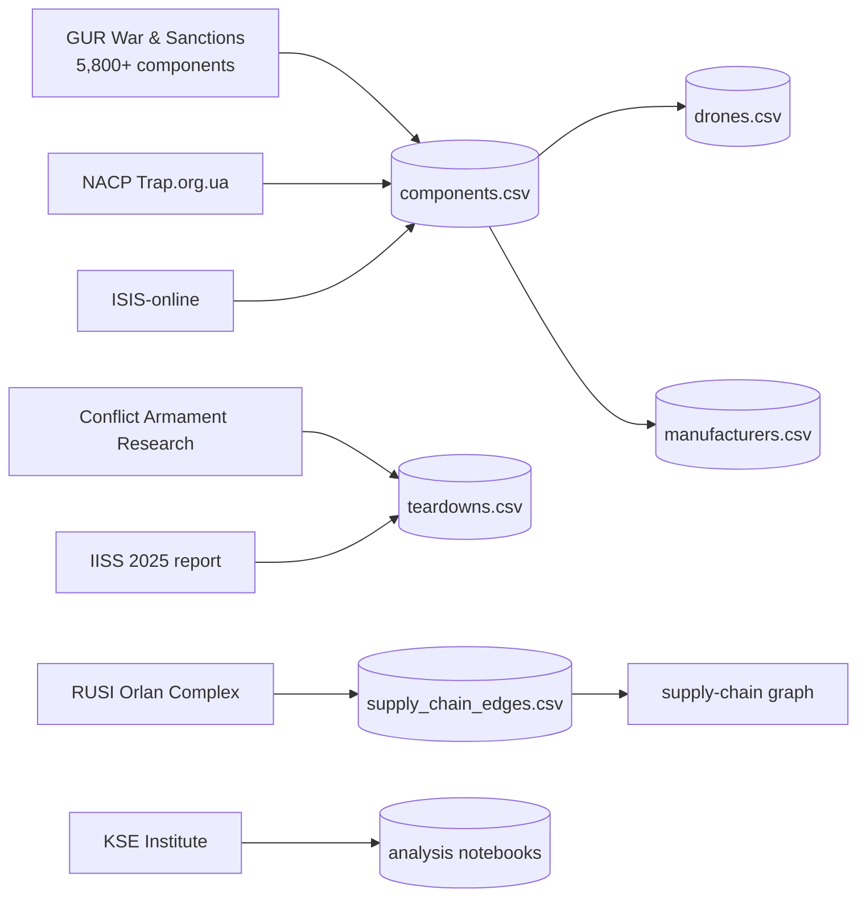

# Awesome Drone Warfare OSINT — docs

This site (built from the `docs/` folder via MkDocs / GitHub Pages) hosts
the human-readable companion to the machine-readable dataset in
[`data/`](https://github.com/cognis-digital/awesome-drone-warfare-osint/tree/main/data).

## Quick links

- [README & headline numbers](https://github.com/cognis-digital/awesome-drone-warfare-osint#-the-dataset-at-a-glance)
- [Drone platforms](drones/index.md)
- [Components by category](components/index.md)
- [Theaters](theaters/index.md)
- [Playbooks (EW, counter-UAS)](playbooks/index.md)
- [Primary sources](sources.md)

## Dataset map

