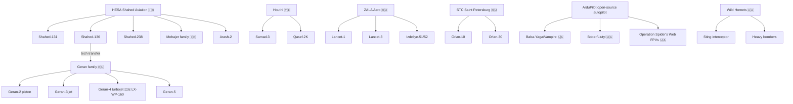

# Drone family tree

The tree omits Western platforms (Switchblade, Bayraktar, Skydio, etc.)
which are catalogued in `data/drones.csv` but not central to the
sanctions-evasion narrative this dataset documents.
